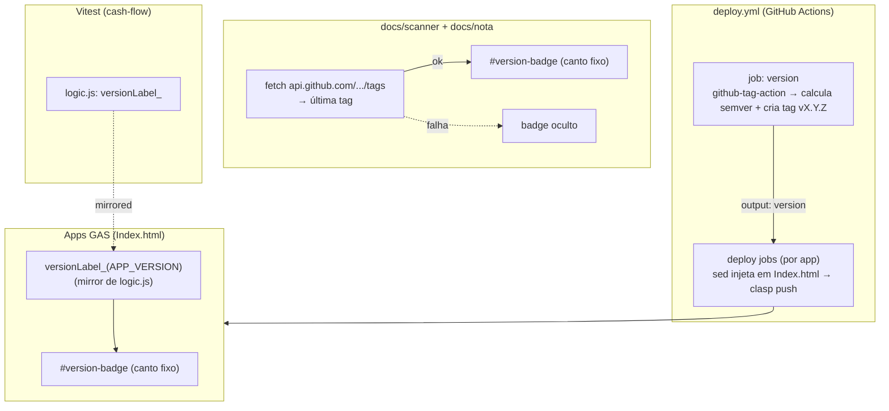

# Versionamento visível nos apps — Design

**Spec**: `.specs/features/app-versioning/spec.md`
**Status**: Draft

---

## Architecture Overview

Duas superfícies com modelos de hospedagem diferentes → **dois mecanismos**, cada um o
mais simples para seu contexto:

- **Apps do Apps Script** (portal, cash-flow, comp-time, book-registration): servidos por
  `clasp push`/deploy. A versão é **injetada por `sed` no CI** (mesmo padrão dos URLs do
  portal), num placeholder no `Index.html`. Uma função pura `versionLabel_` decide o texto
  exibido (`vX.Y.Z` ou `dev`).
- **Páginas estáticas** (docs/scanner, docs/nota): servidas **direto do repositório** pelo
  GitHub Pages (não passam pelo deploy `clasp`). A versão é buscada em **runtime** via API
  pública de tags do GitHub, com degradação graciosa.



**Decisão-chave**: a única lógica decidível/testável é `versionLabel_(raw)` — pura,
determinística. Todo o resto (badge HTML/CSS, injeção `sed`, job de versão, fetch da API)
é **cola**, verificada por build gate + smoke manual, consistente com AD-001 e com o
tratamento de `Code.gs`/deploy no repo.

---

## Componentes

### 1. `versionLabel_(raw)` — função pura (cash-flow/logic.js)

Decide o texto do badge a partir do valor bruto injetado. Requisitos VER-01/VER-02.

```js
function versionLabel_(raw) {
  if (raw == null) return 'dev';
  var s = String(raw).trim();
  if (s === '' || s.charAt(0) === '_') return 'dev'; // placeholder não substituído
  return s.charAt(0).toLowerCase() === 'v' ? s : 'v' + s;
}
```

- `'1.2.0'` → `'v1.2.0'`; `'v1.2.0'` → `'v1.2.0'` (idempotente ao prefixo).
- `'__APP_VERSION__'` (placeholder) → `'dev'`; `''`/`null` → `'dev'`.
- Exportada em `module.exports` (Node/Vitest) e **espelhada inline** em cada `Index.html`
  (mesmo padrão de `validateLancamentoClient_`).

### 2. Badge de versão (cada Index.html)

Elemento fixo, discreto, não intrusivo (VER-03):

```html
<div id="version-badge" aria-hidden="true"></div>
<script>
  var APP_VERSION = '__APP_VERSION__'; // sed substitui no deploy (apps GAS)
  function versionLabel_(raw){ /* mirror de logic.js */ }
  document.getElementById('version-badge').textContent = versionLabel_(APP_VERSION);
</script>
```

CSS (mesmo em todas as superfícies):

```css
#version-badge{
  position:fixed; right:6px; bottom:5px; z-index:2147483000;
  font:11px/1 ui-monospace, monospace; color:#8a8f98; opacity:.65;
  pointer-events:none; user-select:none;
}
```

- `position:fixed` + canto inferior direito → não empurra layout.
- `pointer-events:none` → clique atravessa (VER-03).
- `z-index` alto → visível sobre o conteúdo; texto pequeno/mudo → discreto.

### 3. Páginas estáticas (docs/scanner, docs/nota)

Mesmo badge/CSS, mas a versão vem em **runtime** (VER-08/VER-09):

```js
fetch('https://api.github.com/repos/juliano-pezzini/school-tools/tags?per_page=1')
  .then(function(r){ return r.ok ? r.json() : []; })
  .then(function(tags){
    var name = tags && tags[0] && tags[0].name;
    if (name) document.getElementById('version-badge').textContent = versionLabel_(name);
  })
  .catch(function(){ /* silencioso: badge fica vazio/oculto */ });
```

- Falha/indisponibilidade → `catch`/`ok===false` → badge permanece vazio (oculto), sem erro.
- Owner/repo derivados do repositório público (mesmo usado nos favicons via jsDelivr).

### 4. CI — job `version` + injeção (deploy.yml)

- **Novo job `version`** (roda quando qualquer deployável muda): usa
  `mathieudutour/github-tag-action` para calcular a próxima semver a partir da última tag +
  Conventional Commits e **criar a tag** `vX.Y.Z`. Expõe `outputs.version` (`new_version`).
  Verificar API exata da action na implementação (Knowledge Verification Chain: docs).
- **Jobs de deploy** ganham `needs: [..., version]` e, **antes do `clasp push`**, um passo
  de injeção que substitui o valor do placeholder no `Index.html`:

  ```bash
  sed -i "s|var APP_VERSION = '__APP_VERSION__'|var APP_VERSION = '${VERSION}'|" Index.html
  ```

  O placeholder é **committado uma vez** no repo (`__APP_VERSION__`) e nunca alterado no
  git — a substituição é **efêmera** (só no runner). Assim, sem deploy, o repo mantém o
  placeholder → badge mostra `dev` (VER-02).
- **VER-07**: se a action não produzir nova versão, o passo usa a versão vigente (última
  tag) e o deploy não quebra; a criação de tag é idempotente/condicional.

---

## Code Reuse Analysis

| Componente | Localização | Como usar |
| ---------- | ----------- | --------- |
| Padrão `sed` de injeção no deploy | `.github/workflows/deploy.yml` (portal: `REPLACE_WITH_*`) | Reusar o mesmo padrão para injetar a versão nos apps GAS |
| Padrão "pura em logic.js + mirror inline em Index.html" | `validateLancamentoClient_` (logic.js + cash-flow/Index.html) | Mesmo padrão para `versionLabel_` |
| Guard dual-env `module.exports` | `cash-flow/logic.js` (final) | Adicionar `versionLabel_` ao export |
| CDNs externos já usados sob CSP | Google Fonts / Chart.js / jsDelivr nos apps | Precedente de que `fetch` externo funciona (páginas estáticas usam api.github.com) |

---

## Requirement → Component Map

| Req | Componente |
| --- | ---------- |
| VER-01 | Badge nos 4 apps GAS + `versionLabel_` |
| VER-02 | `versionLabel_` (fallback `dev`) |
| VER-03 | CSS do badge (`position:fixed`, `pointer-events:none`) |
| VER-04 | Job `version` (github-tag-action, Conventional Commits) |
| VER-05 | Job `version` cria tag `vX.Y.Z` |
| VER-06 | Passo `sed` de injeção antes do `clasp push` |
| VER-07 | Fallback do job (sem nova versão → não quebra) |
| VER-08 | Fetch de tags nas páginas estáticas |
| VER-09 | `catch`/`ok===false` → badge oculto |

---

## Risks & Mitigations

| Risco | Mitigação |
| ----- | --------- |
| API do GitHub com rate-limit (60/h por IP, sem auth) nas páginas estáticas | Baixo tráfego (uso escolar); degradação graciosa se limitado |
| Comportamento exato da tag-action (primeira versão sem tags) | Verificar docs na implementação; sem tag → base definida pela action |
| `sed` não casar o placeholder (formatação divergente) | Placeholder e passo `sed` idênticos em todos os apps; build gate confere sintaxe |
| Injeção quebrar sintaxe do Index.html | `versionLabel_` isolado; smoke manual no deploy |
