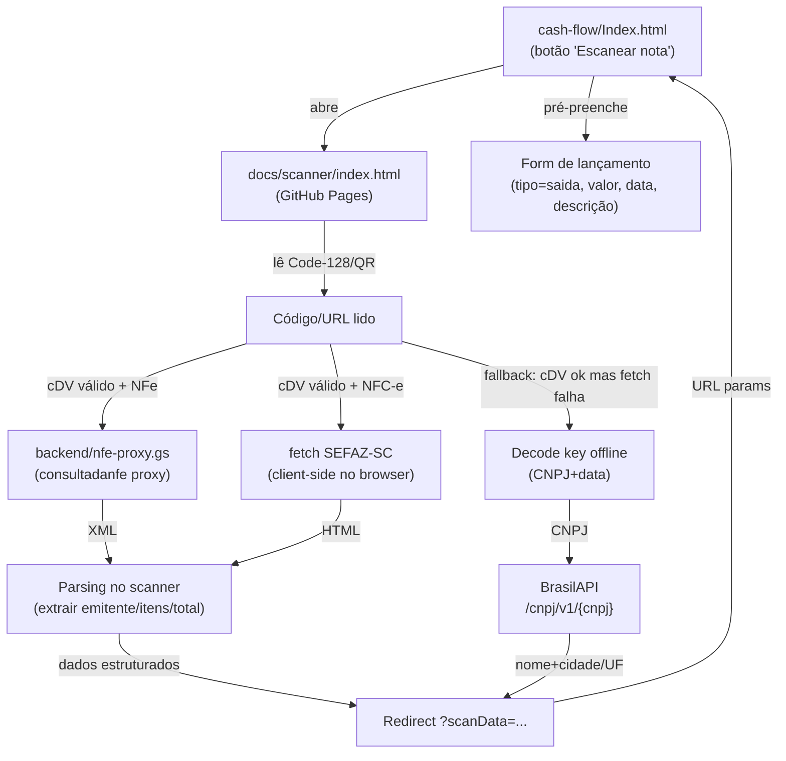

# Captura por NFe/NFC-e — Design

**Spec**: `.specs/features/captura-nfe/spec.md`
**Status**: Draft

---

## Architecture Overview

The feature extends **three existing components** and adds **pure logic** (Vitest-testable):



**Key architectural decision**: The **scanner page** (`docs/scanner/index.html`) becomes the orchestrator of the full flow — scan → validate → extract → redirect. The cash-flow app is a dumb receiver of structured data via URL params. This keeps the extraction logic in a real browser context (solving Cloudflare for NFC-e) and avoids adding complexity to the HtmlService iframe.

---

## Code Reuse Analysis

### Existing Components to Leverage

| Component | Location | How to Use |
| --------- | -------- | ---------- |
| Scanner page (camera, BarcodeDetector/ZXing, double-read) | `docs/scanner/index.html` | **Extend** with post-scan extraction logic + structured redirect |
| Nota test page (key parse, cDV, NFe proxy call, XML parse, BrasilAPI) | `docs/nota/index.html` | **Port** extraction functions into the scanner page (merge the nota logic into the scanner) |
| NFe proxy | `backend/nfe-proxy.gs` | **Reuse as-is** — already deployed, validates chave, calls consultadanfe, returns JSON |
| Cash-flow form + `google.script.run` | `cash-flow/Index.html` | **Extend** with `?scanData=...` URL param handling on page load + "Escanear nota" button |
| Pure logic (`logic.js`) | `cash-flow/logic.js` | **Add** `parseChaveNFe_`, `chaveValida_`, `buildScanDescription_` — testable with Vitest |

### Integration Points

| System | Integration Method |
| ------ | ------------------ |
| consultadanfe.com | Existing proxy (`backend/nfe-proxy.gs`) called via GET from scanner page |
| SEFAZ-SC NFC-e | Client-side `fetch` in scanner page (real browser bypasses Cloudflare) |
| BrasilAPI | Client-side `fetch` from scanner page (CORS-friendly, no auth) |
| Cash-flow app | URL params on return (`?scanData=base64(JSON)`) — parsed on page load by `doGet` or client JS |

---

## Components

### Pure Logic — Key parsing + description builder (`logic.js`)

- **Purpose**: Decode NFe/NFC-e access key (CNPJ, date, model, cDV validation), build description string from extracted data.
- **Location**: `cash-flow/logic.js` (appended after existing functions)
- **Interfaces**:
  - `parseChaveNFe_(chave)` → `{ cUF, uf, ano, mes, cnpj, modelo, serie, numero, cDV }` or throws if not 44 digits
  - `chaveValida_(chave)` → `boolean` (cDV mod-11 check)
  - `buildScanDescription_(data)` → `string` (≤280 chars: `FORNECEDOR (Cidade/UF) — item1, item2, ...`)
- **Dependencies**: None (pure)
- **Reuses**: `dvChave` / `parseChave` / `chaveValida` from `docs/nota/index.html` (ported to dual-env)

### Scanner Page — Extended with extraction (`docs/scanner/index.html`)

- **Purpose**: Scan → validate cDV → classify (NFe/NFC-e) → extract data (proxy or client-side SEFAZ) → redirect with structured data.
- **Location**: `docs/scanner/index.html` (rewrite to merge scanning + extraction)
- **Interfaces**:
  - Input: `?return=<app_url>&mode=nfe` (mode=nfe tells the scanner to do the full extraction flow, not just return a raw code)
  - Output: redirect to `<return_url>?scanData=<base64url(JSON)>` where JSON = `{ fornecedor, cidade, uf, data, valor, itens, link, parcial }`
  - On cancel/close: redirect to `<return_url>` (no `scanData` param)
- **Dependencies**: ZXing CDN (fallback), BarcodeDetector native, nfe-proxy.gs URL (configurable via `?proxy=...` or hardcoded default)
- **Reuses**: Camera/scan logic from current scanner, extraction logic from `docs/nota/index.html`

### Cash-Flow UI — Scan button + data receiver (`Index.html`)

- **Purpose**: "Escanear nota" button opens scanner; on return, parse `scanData` from URL and pre-fill the lançamento form.
- **Location**: `cash-flow/Index.html`
- **Interfaces**:
  - Button "Escanear nota" (next to the form) → opens scanner URL with `?return=<this_page_url>&mode=nfe`
  - On page load: check for `?scanData=...` param → decode → call `prefillFromScan(data)` → fill tipo/valor/data/descrição
  - When `data.parcial=true`: show info banner "Dados parciais — complete manualmente" + optional SEFAZ link
- **Dependencies**: Scanner page URL (GitHub Pages), existing form fields
- **Reuses**: Existing form population patterns, `google.script.run` submission flow

---

## Data Models

### Scan Data (JSON transported via URL)

```javascript
{
  fornecedor: "ANTARES COM. DE ALIMENTOS LTDA",  // emitente name
  cidade: "Itu",                                   // city
  uf: "SP",                                        // state
  data: "2025-07-15",                              // emission date (ISO)
  valor: 173.91,                                   // total value (number)
  itens: "3x Arroz 5kg, 2x Feijão 1kg, 1x Óleo", // summarized items string
  link: "",                                        // SEFAZ link (NFC-e fallback)
  parcial: false                                   // true if extraction failed
}
```

### Pre-fill mapping

| scanData field | Form field | Notes |
| -------------- | ---------- | ----- |
| — | Tipo | Always `saida` (hardcoded) |
| `valor` | Valor | Formatted as number; blank if `parcial` |
| `data` | Data | ISO `yyyy-MM-dd` for the date input |
| `fornecedor` + `cidade/uf` + `itens` | Descrição | `buildScanDescription_` output (≤280 chars) |
| — | Categoria | Left blank (user picks) |

---

## Error Handling Strategy

| Error Scenario | Handling | User Impact |
| -------------- | -------- | ----------- |
| cDV invalid | Scanner rejects immediately, shows "Código inválido", stays active | User scans again |
| Proxy (consultadanfe) fails / note too old | Fallback: decode key + BrasilAPI → partial data | Form partially filled (fornecedor+data); user enters valor manually |
| NFC-e SEFAZ fetch blocked (Cloudflare) | Fallback: decode key + BrasilAPI → partial + SEFAZ link | Form partially filled + "Ver nota na SEFAZ" link |
| BrasilAPI unavailable | Use raw CNPJ as supplier name | Slightly less readable description |
| Scanner page closed/cancelled | No `scanData` param on return | Form unchanged |
| Non-44-digit code scanned | Ignored silently (not a fiscal note) | Scanner keeps scanning |
| Network totally offline | cDV still validates offline; extraction fails → partial with CNPJ only | Minimal pre-fill |

---

## Risks & Concerns

| Concern | Location | Impact | Mitigation |
| ------- | -------- | ------ | ---------- |
| SEFAZ-SC HTML structure may change | Scanner page NFC-e parser | Parser breaks → fallback activates (partial data) | Parser is defensive; test with real notes; fallback ensures feature doesn't crash |
| consultadanfe.com service limit (mês corrente only for free) | NFe extraction | Old notes → fallback | Spec already defines graceful degradation |
| URL length limit with `scanData` base64 | Browser URL bar | Very long item lists could exceed ~2000 char URL | Truncate items in the JSON before encoding; `buildScanDescription_` caps at 280 chars anyway |
| GitHub Pages may not be published yet | Scanner page | Feature doesn't work without the published page | README documents the publish steps; works on localhost for dev |

---

## Tech Decisions

| Decision | Choice | Rationale |
| -------- | ------ | --------- |
| Scanner page as orchestrator (not the Apps Script app) | Extraction happens in scanner page | Solves Cloudflare (NFC-e needs real browser); keeps cash-flow app simple (just receives data) |
| `scanData` as base64url JSON in URL params | Structured transport | Avoids multiple params; survives URL encoding; single decode on receiver side |
| Merge nota test page logic into scanner | One page does scan + extraction | Eliminates the nota page as a separate artifact; DRY |
| Pure key parsing/description in `logic.js` | Testable with Vitest | Same pattern as all other features; cDV validation is decidable logic |
| Proxy URL hardcoded with `?proxy=` override | Configurable for testing | Same pattern as nota test page; default points to deployed proxy |

---

## Test Strategy

| Code Layer | Test Type | Location | Run Command |
| ---------- | --------- | -------- | ----------- |
| Pure logic (`logic.js`: `parseChaveNFe_`, `chaveValida_`, `buildScanDescription_`) | unit (Vitest) | `cash-flow/scan-nfe.test.js` | `npm test` |
| Scanner page (extraction orchestration) | none | — | manual smoke (real phone + real notes) |
| Cash-flow UI (button + receiver) | none | — | manual smoke |
| Proxy (`nfe-proxy.gs`) | none | — | already deployed and validated in spike |

**Why "none" for scanner/UI/proxy**: Same rationale (AD-001) — browser APIs, Apps Script APIs, and cross-origin flows can't be meaningfully unit-tested. All decidable logic (key parsing, cDV, description building) lives in `logic.js`.
