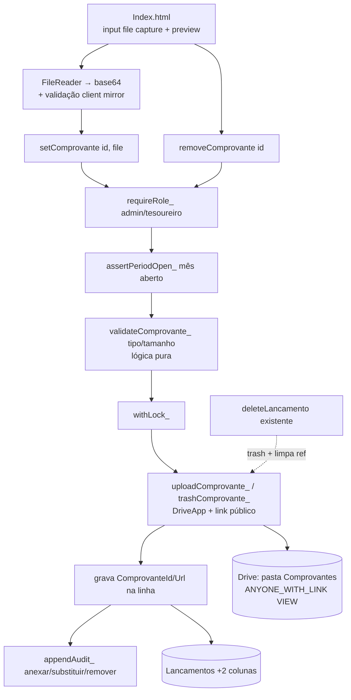

# Comprovantes — Design

**Spec:** [.specs/features/comprovantes/spec.md](spec.md)
**Context:** [.specs/features/comprovantes/context.md](context.md)
**Status:** Draft

---

## Architecture Overview

A feature adiciona uma dimensão de **arquivo** à ferramenta `cash-flow/` já existente, sem tocar no núcleo de saldo/lançamentos. O comprovante é um **anexo isolado por lançamento**: um arquivo no Google Drive (link público, AD-005/B-006) referenciado por duas colunas novas na aba `Lancamentos` (`ComprovanteId`, `ComprovanteUrl`).

Decisão-chave de acoplamento: **o anexo é sempre uma operação separada da gravação do lançamento** — `addLancamento` não muda. No registro, a UI primeiro cria o lançamento (recebe o `id`) e, se houver arquivo escolhido, chama `setComprovante(id, file)` em seguida. Isso concretiza a regra "falha de upload nunca perde o lançamento" (COMP-05 AC4) de graça: o lançamento já está salvo antes do upload.

A parte **decidível** (validação de tipo/tamanho, nome do arquivo) vai para a lógica pura testável `cash-flow/logic.js` (Vitest, mesmo padrão da feature Lançamentos). A **cola** de Drive/Sheets (upload, link público, lixeira, escrita nas colunas) fica em `cash-flow/Code.gs`, verificada por deploy smoke — mesma divisão da matriz de testes de Lançamentos.



---

## Code Reuse Analysis

### Existing Components to Leverage

| Component | Location | How to Use |
| --------- | -------- | ---------- |
| `requireRole_(['admin','tesoureiro'])` + leitura c/ `leitor` | [cash-flow/Code.gs](../../../cash-flow/Code.gs) | Barreira de escrita/leitura — reuso direto, sem mudança. |
| `withLock_(fn)` | [cash-flow/Code.gs](../../../cash-flow/Code.gs) | Serializa anexar/substituir/remover (COMP-09), evitando arquivo órfão/dup. |
| `assertPeriodOpen_(data, closedPeriods_())` | [cash-flow/logic.js](../../../cash-flow/logic.js) + `closedPeriods_` | Bloquear anexar/remover em mês fechado (COMP-03/04). |
| `readLancamentoRows_()` / `findLancamentoById_(rows,id)` | [cash-flow/Code.gs](../../../cash-flow/Code.gs) | Localizar a linha do lançamento; **estender** para ler as 2 colunas novas + expor `_row`. |
| `appendAudit_(acao, id, detalhe)` | [cash-flow/Code.gs](../../../cash-flow/Code.gs) | Trilha append-only para `anexar`/`substituir`/`remover_comprovante` (COMP-08). |
| `serializeRows_(rows)` | [cash-flow/Code.gs](../../../cash-flow/Code.gs) | **Estender** para incluir `ComprovanteUrl` no payload da lista/dashboard (COMP-02). |
| `buildSheets_(ss)` | [cash-flow/Code.gs](../../../cash-flow/Code.gs) | **Estender** o cabeçalho de `Lancamentos` de 14 → 16 colunas. |
| Padrão de Drive + link público (`folder.createFile(blob)` + `setSharing(ANYONE_WITH_LINK, VIEW)`, `getFoldersByName`/`createFolder`) | [spikes/m0-reports/Code.gs:325](../../../spikes/m0-reports/Code.gs) | Base de `uploadComprovante_` e `getComprovanteFolder_`. |
| Helper de export dual-env (`typeof module !== 'undefined'`) e harness Vitest | [cash-flow/logic.js](../../../cash-flow/logic.js) + `*.test.js` | Adicionar `validateComprovante_`/`comprovanteFileName_` à lógica pura + `comprovante.test.js`. |
| `<input>` + `google.script.run` + `validateClient` (pre-validação otimista) | [cash-flow/Index.html](../../../cash-flow/Index.html) | Adicionar `<input type="file" capture>`, `FileReader`, indicador na lista e espelho client-side da validação de tipo/tamanho. |

### Integration Points

| System | Integration Method |
| ------ | ------------------ |
| Google Drive | `DriveApp` — pasta dedicada (id em `PropertiesService.COMPROVANTES_FOLDER_ID`), `createFile` a partir de blob base64, `setSharing(ANYONE_WITH_LINK, VIEW)`, `getFileById(id).setTrashed(true)`. |
| Aba `Lancamentos` | +2 colunas ao final (`ComprovanteId` col 15, `ComprovanteUrl` col 16) — aditivo; linhas antigas = "sem comprovante". |
| Feature "Relatórios" (futura) | Consome `ComprovanteUrl` da linha para exibir o link no relatório público. Esta feature só grava a referência com permissão pública. |
| `appsscript.json` | Já inclui o escopo `drive` (copiado do m0-roles) — sem novo escopo. **Verificar** na T de scaffold. |

---

## Components

### Lógica pura (`cash-flow/logic.js`) — testável (Vitest)

#### `validateComprovante_(file, opts)`
- **Purpose**: Decidir se um arquivo é aceitável (tipo na whitelist, tamanho ≤ máx) — a única parte decidível da validação (COMP-05).
- **Interface**: `validateComprovante_({ name, mimeType, size }, { allowedTypes, maxBytes }) → { ok:true } | throw Error(msg pt-BR)`.
- **Regras**: `mimeType` deve estar na whitelist (`image/jpeg|png|webp|heic|heif`, `application/pdf`); `size > 0` e `≤ maxBytes`; nome não vazio. Mensagens pt-BR fixas (espelhadas na UI).
- **Reuses**: padrão de sanitização de fronteira da feature Lançamentos.

#### `comprovanteFileName_(lancamentoId, mimeType, timestampMs)`
- **Purpose**: Nome determinístico e rastreável do arquivo no Drive.
- **Interface**: `→ '<lancamentoId>_<timestampMs>.<ext>'`, onde `ext` vem de um mapa `mimeType→ext` (`extForMime_`). MIME desconhecido (não deveria chegar, já validado) → `.bin`.
- **Reuses**: —

> Constantes compartilhadas: `COMPROVANTE_TIPOS` (whitelist) e `COMPROVANTE_MAX_BYTES` (10 MB) exportadas de `logic.js` para o dual-env, consumidas tanto pelos testes quanto pela cola.

### Cola Apps Script (`cash-flow/Code.gs`) — deploy smoke

#### `getComprovanteFolder_()`
- **Purpose**: Obter/criar a pasta do Drive de comprovantes; id persistido em `PropertiesService`.
- **Interface**: `→ Folder`. Se `COMPROVANTES_FOLDER_ID` existe e é válido, usa; senão cria "Comprovantes - Caixa APP", grava o id.
- **Reuses**: `getReportFolder_` do m0-reports (padrão folder-by-name), endurecido com id persistido.

#### `uploadComprovante_(lancamentoId, file)`
- **Purpose**: Gravar o arquivo no Drive com link público e devolver `{ id, url }`.
- **Interface**: `file = { name, mimeType, bytesBase64, size }` → `{ id, url }`. `Utilities.base64Decode` → `Utilities.newBlob(bytes, mimeType, comprovanteFileName_())` → `folder.createFile(blob)` → `setSharing(ANYONE_WITH_LINK, VIEW)`.
- **Dependencies**: `getComprovanteFolder_`, `DriveApp`, `Utilities`.

#### `trashComprovante_(fileId)`
- **Purpose**: Mandar o arquivo para a lixeira (recuperável ~30 dias). Tolerante a arquivo já ausente (não lança).
- **Interface**: `trashComprovante_(fileId) → void`. `try { DriveApp.getFileById(fileId).setTrashed(true) } catch(e) { /* já removido */ }`.

#### `setComprovante(lancamentoId, file)` *(exposta)*
- **Purpose**: Anexar ou **substituir** o comprovante de um lançamento (COMP-01/03).
- **Fluxo**: `requireRole_(['admin','tesoureiro'])` → `withLock_`: localizar linha (viva) → `assertPeriodOpen_(row.Data, closedPeriods_())` → `validateComprovante_(file, {...})` → `uploadComprovante_` → se a linha já tinha `ComprovanteId`, `trashComprovante_(antigo)` → gravar `ComprovanteId/Url` (cols 15-16) → `appendAudit_(antigo ? 'substituir' : 'anexar', id, resumo)`. Retorna `{ ok, url, id: fileId }`.
- **Idempotência/concorrência (COMP-09)**: tudo sob o lock; a substituição troca a referência e descarta a anterior — reenvio não deixa órfão.

#### `removeComprovante(lancamentoId)` *(exposta)*
- **Purpose**: Remover o comprovante sem apagar o lançamento (COMP-04).
- **Fluxo**: `requireRole_` → `withLock_`: localizar linha → `assertPeriodOpen_` → se há `ComprovanteId`, `trashComprovante_` → limpar cols 15-16 → `appendAudit_('remover_comprovante', id, ...)`. No-op tolerante se não há comprovante. Retorna `{ ok }`.

#### `deleteLancamento(id)` *(modificada — COMP-07)*
- **Change**: antes de/junto ao soft-delete, se a linha tem `ComprovanteId`: `trashComprovante_` e limpar cols 15-16 (dentro do lock já existente). Auditoria de exclusão inalterada; o resumo pode mencionar que havia comprovante.

#### `readLancamentoRows_()` *(modificada)*
- **Change**: ler `ComprovanteId = String(r[14]||'')`, `ComprovanteUrl = String(r[15]||'')`; manter compatibilidade retroativa (colunas ausentes → `''`).

#### `serializeRows_(rows)` *(modificada — COMP-02)*
- **Change**: incluir `ComprovanteUrl` (e `TemComprovante: !!r.ComprovanteId`) no objeto enviado ao cliente.

#### `buildSheets_(ss)` *(modificada)*
- **Change**: cabeçalho de `Lancamentos` passa a 16 colunas, acrescentando `ComprovanteId`, `ComprovanteUrl`.

### UI (`cash-flow/Index.html`) — verificação manual

- **Formulário**: `<input type="file" id="lComprovante" accept="image/*,application/pdf" capture="environment">` + nome do arquivo escolhido + aviso discreto de privacidade (link público). No `submitLancamento`, após `addLancamento` retornar `id`, se há arquivo: ler via `FileReader.readAsDataURL`, extrair base64, **espelhar a validação** de tipo/tamanho (repo convention: client mirror) e chamar `setComprovante`.
- **Lista**: coluna/indicador "Comprovante" — link "ver" (abre `ComprovanteUrl`) quando `TemComprovante`, senão "—". Ações "anexar/trocar" e "remover" quando o mês está aberto (reusa o estado de períodos fechados já carregado).
- **Estados**: sucesso/erro de anexo separado do resultado do lançamento (`lResult` já existe); botão desabilitado durante upload (anti-duplo-clique, espelha COMP-09).

---

## Data Models

### Linha de `Lancamentos` (estendida)

| Col | Campo | Tipo | Novo? |
| --- | ----- | ---- | ----- |
| 1–14 | Id … ClientToken | (inalterado) | — |
| 15 | `ComprovanteId` | string (Drive fileId) ou `''` | ⭐ |
| 16 | `ComprovanteUrl` | string (link de visualização) ou `''` | ⭐ |

### Payload de arquivo (UI → servidor)

```typescript
interface ComprovanteFile {
  name: string       // nome original do arquivo
  mimeType: string   // ex.: 'image/jpeg', 'application/pdf'
  size: number       // bytes (do File.size, para validação)
  bytesBase64: string // conteúdo em base64 (sem o prefixo data:)
}
```

### Registro de `Auditoria` (reuso)

Ações novas na coluna `Acao`: `anexar`, `substituir`, `remover_comprovante`. `Detalhe` = resumo curto (id do arquivo novo/antigo, nome).

---

## Error Handling Strategy

| Error Scenario | Handling | User Impact |
| -------------- | -------- | ----------- |
| Tipo fora da whitelist / tamanho > 10 MB | `validateComprovante_` lança pt-BR (client mirror pega antes) | Mensagem clara; nada é enviado/gravado |
| Upload ao Drive falha (cota/indisponível) | `setComprovante` propaga erro; **o lançamento já foi salvo antes** | "Comprovante não salvo, tente anexar de novo"; lançamento intacto |
| Mês fechado | `assertPeriodOpen_` lança pt-BR (`MM/AAAA`) | Ação bloqueada, nada muda |
| Papel sem permissão | `requireRole_` lança | "Acesso negado…" |
| Duplo-clique / reenvio do anexo | `withLock_` serializa; substituição troca a referência | Uma referência, sem arquivo órfão |
| Arquivo já ausente ao mandar p/ lixeira | `trashComprovante_` engole a exceção | Remoção/soft-delete concluída mesmo assim |
| Lançamento não encontrado / já excluído | `findLancamentoById_` retorna null → lança | "Lançamento não encontrado." |

---

## Risks & Concerns

| Concern | Location | Impact | Mitigation |
| ------- | -------- | ------ | ---------- |
| Colunas novas em base **já existente** (deploy em planilha com dados) | `buildSheets_` só roda na criação | Planilhas já criadas não ganham os cabeçalhos automaticamente | `readLancamentoRows_`/`serializeRows_` tratam colunas ausentes como `''` (retrocompat). Se a base já existe, o cabeçalho pode ser adicionado manualmente no smoke; documentar no checklist da task de scaffold/glue. |
| Link público expõe dados sensíveis do comprovante (⚠️ trade-off aceito) | `uploadComprovante_` `setSharing(ANYONE_WITH_LINK)` | Comprovante acessível sem login por quem tiver o link | Escolha explícita do usuário (B-006). UI mostra aviso discreto de privacidade. Registrado como **AD-011** no STATE. |
| Payload base64 grande no `google.script.run` | `setComprovante` | Arquivos grandes podem estourar limites/latência | Limite de 10 MB validado nos dois lados; base64 (~+33%) fica bem abaixo do teto do transporte. |
| `PropertiesService.COMPROVANTES_FOLDER_ID` apontando para pasta apagada | `getComprovanteFolder_` | `getFolderById` lança se a pasta some | `try/catch` → recria a pasta e regrava o id. |
| MIME reportado pelo cliente pode ser vazio/impreciso (alguns celulares) | `validateComprovante_` | Foto legítima rejeitada por MIME vazio | Aceitar também inferência por extensão do nome como fallback dentro da whitelist; cobrir no teste. |

---

## Tech Decisions (non-obvious)

| Decision | Choice | Rationale |
| -------- | ------ | --------- |
| Anexo separado da gravação do lançamento | `setComprovante(id, file)` chamado **após** `addLancamento` | Garante "falha de upload não perde o lançamento" (COMP-05 AC4) sem lógica de rollback; mantém `addLancamento` intacto. |
| Um comprovante por linha (2 colunas) vs. tabela de anexos | 2 colunas na própria linha | Escopo é 1 por lançamento; evita nova aba/JOIN, coerente com AD-001 (simplicidade). |
| Lixeira em vez de exclusão definitiva | `setTrashed(true)` | Recuperação ~30 dias; alinhado à filosofia soft-delete da ferramenta. |
| Validação decidível na lógica pura | `validateComprovante_` em `logic.js` | Testável em Node (Vitest); a cola Drive fica fina e verificada por smoke, como a matriz de Lançamentos. |
| Link público do arquivo | `ANYONE_WITH_LINK, VIEW` | Necessário para o relatório público dos pais (B-006); precedente já usado no spike m0-reports. Registrado em **AD-011**. |

> **AD-011** será acrescentado a `.specs/STATE.md` `## Decisions` para registrar a exposição por link público dos comprovantes (exceção consciente e escopada a AD-005, precedente B-006/m0-reports).

---

## Tips aplicados

- Reuso máximo do que a feature Lançamentos já provou (auth, lock, auditoria, Drive do m0-reports).
- Interfaces definidas antes da implementação; lógica decidível isolada e testável.
- Concerns de retrocompatibilidade de schema e privacidade explicitados com mitigação.
