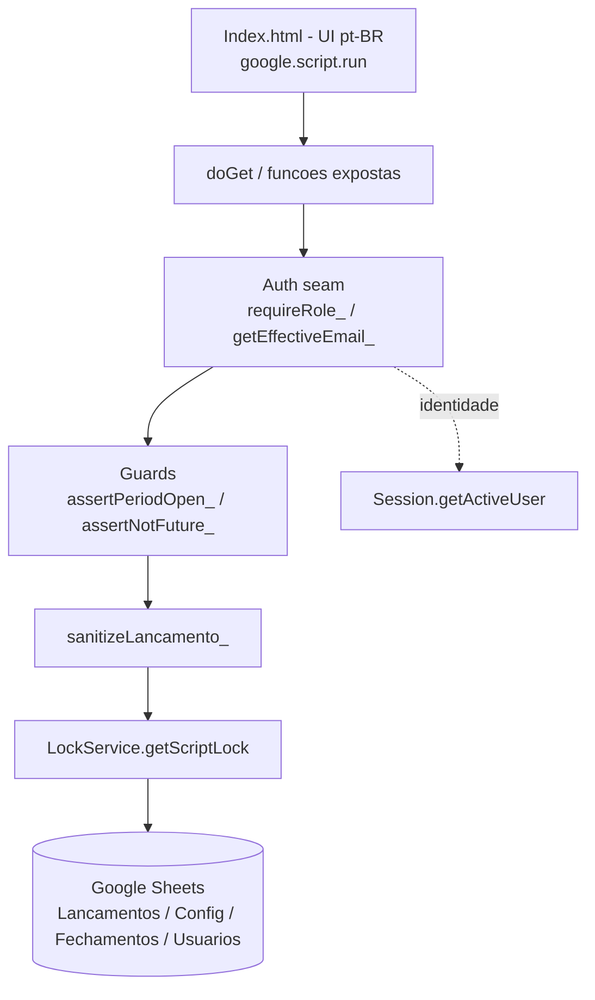

# Lançamentos & Saldo — Design

**Spec**: [.specs/features/lancamentos-saldo/spec.md](spec.md)
**Context**: [.specs/features/lancamentos-saldo/context.md](context.md)
**Status**: Draft

---

## Architecture Overview

Primeira ferramenta de produção (não-spike). Mesma stack A validada no M0: **web app Apps Script** (HtmlService) com dados em **Google Sheets**, identidade via **Google Workspace SSO** e autorização **server-side**. Vive em `cash-flow/` (hoje vazio).

Toda escrita passa por três barreiras no servidor, nesta ordem: **autorização** (papel) → **guarda de período/data** (mês aberto, data não-futura) → **sanitização** (fronteira). O saldo é **recalculado sob demanda** (volume pequeno; evita saldo materializado fora de sincronia). Concorrência protegida por **LockService**.

---

## Code Reuse Analysis

A maior parte da fundação já foi provada nos spikes do M0. Esta feature **promove** esses padrões a código de produção em `cash-flow/`.

### Existing Components to Leverage

| Component | Location | How to Use |
| --------- | -------- | ---------- |
| Auth seam (`getRealEmail_`, `getEffectiveEmail_`, `roleOf_`, `requireRole_`, `ensureBootstrapAdmin_`, `countAdmins_`) | [spikes/m0-roles/Code.gs](../../../spikes/m0-roles/Code.gs) | Copiar como base do módulo de autorização; é o seam que a feature "Papéis" depois assume por inteiro. |
| Data layer pattern (`getSpreadsheet_` via `PropertiesService` + `PROP_SHEET_ID`, `buildSheets_`, append/read por aba) | [spikes/m0-roles/Code.gs](../../../spikes/m0-roles/Code.gs) | Mesmo padrão de bootstrap da planilha e leitura linha-a-linha. |
| Sanitização de fronteira (`sanitizeLancamento_`) | [spikes/m0-roles/Code.gs](../../../spikes/m0-roles/Code.gs) | Estender: além de tipo/valor/categoria/descrição, validar data e normalizar moeda. |
| Helpers pt-BR (`formatBRL_`, `formatDate_`, `MONTH_NAMES`, `TZ`) | [spikes/m0-reports/Code.gs](../../../spikes/m0-reports/Code.gs) | Reusar formatação R$/dd-mm-aaaa e timezone `America/Sao_Paulo`. |
| Agregação de saldo (somar entradas − saídas) | [spikes/m0-reports/Code.gs](../../../spikes/m0-reports/Code.gs) | Base do cálculo de saldo corrente (sem o materializar). |
| `appsscript.json` (scopes, `executeAs USER_DEPLOYING`, `access DOMAIN`) | [spikes/m0-roles/appsscript.json](../../../spikes/m0-roles/appsscript.json) | Copiar tal qual (sheets + drive + userinfo.email). |

### Integration Points

| System | Integration Method |
| ------ | ------------------ |
| Google Workspace SSO | `Session.getActiveUser().getEmail()` como âncora de identidade (confiável no domínio). |
| Feature "Papéis" (futura) | Esta feature cria a aba `Usuarios` + `requireRole_` mínimos; a feature Papéis assume a gestão completa de papéis. Contrato: `requireRole_(['admin','tesoureiro'])`. |
| Feature "Relatórios" (futura) | Lê a aba `Lancamentos` + `Config` (abertura) + `Fechamentos`. Esta feature define o schema; Relatórios só consome. |

---

## Components

Tudo em `cash-flow/Code.gs` (organizado por seções) + `cash-flow/Index.html` + `cash-flow/appsscript.json`. Um único arquivo `.gs` segue a convenção dos spikes; se crescer, dividir por seção.

### Web entry
- **Purpose**: Servir a UI e expor as funções chamáveis via `google.script.run`.
- **Location**: `cash-flow/Code.gs`
- **Interfaces**: `doGet()` → `HtmlService` Index.
- **Reuses**: padrão `doGet` dos spikes.

### Auth seam
- **Purpose**: Resolver identidade e barrar ações por papel no servidor.
- **Interfaces**: `getRealEmail_()`, `getEffectiveEmail_()`, `roleOf_(email)`, `requireRole_(allowed)`, `ensureBootstrapAdmin_()`.
- **Dependencies**: aba `Usuarios`, `Session`, `PropertiesService`.
- **Reuses**: m0-roles (cópia direta, sem a parte de simulação "ver como" — não é necessária aqui).

### Lançamentos service
- **Purpose**: CRUD dos lançamentos com guardas.
- **Interfaces** (expostas):
  - `listLancamentos(filtro)` → `Lancamento[]` — papel: admin/tesoureiro/leitor.
  - `addLancamento(item)` → `{ ok, id }` — papel: admin/tesoureiro.
  - `editLancamento(id, item)` → `{ ok }` — papel: admin/tesoureiro.
  - `deleteLancamento(id)` → `{ ok }` — papel: admin/tesoureiro.
- **Dependencies**: auth seam, guards, sanitização, LockService, aba `Lancamentos` + `Fechamentos`.

### Saldo service
- **Purpose**: Saldo de abertura + saldo corrente.
- **Interfaces**:
  - `getCashState()` → `{ aberturaDefinida, saldoAbertura, totalEntradas, totalSaidas, saldoAtual }` — admin/tesoureiro/leitor.
  - `setOpeningBalance({ valor, data })` → `{ ok }` — admin/tesoureiro; falha se já definido.
- **Dependencies**: aba `Config` (abertura) + `Lancamentos`.
- **Reuses**: agregação do m0-reports.

### Fechamento service
- **Purpose**: Fechar/reabrir mês e expor estado dos períodos.
- **Interfaces**:
  - `listClosedPeriods()` → `Periodo[]`.
  - `closeMonth(periodo)` → `{ ok }` — admin/tesoureiro.
  - `reopenMonth(periodo)` → `{ ok }` — admin/tesoureiro.
  - `isPeriodClosed_(yyyymm)` → `boolean` (interno).
- **Dependencies**: aba `Fechamentos`, LockService.

### Categorias
- **Purpose**: Autocomplete de categorias já usadas.
- **Interfaces**: `listCategorias()` → `string[]` (distintas, ordenadas) — admin/tesoureiro.
- **Dependencies**: aba `Lancamentos`.

### Validation / helpers
- **Interfaces**: `sanitizeLancamento_(item)`, `assertNotFuture_(date)`, `assertPeriodOpen_(date)`, `periodKey_(date)` (→ `'YYYY-MM'`), `parseDateBR_`, `formatDate_`, `formatBRL_`.

---

## Data Models

Uma planilha (`Fluxo de Caixa — APP (dados)`), ID guardado em `PropertiesService` (`CASHFLOW_SHEET_ID`). Quatro abas.

### Aba `Lancamentos`

| Coluna | Tipo | Notas |
| ------ | ---- | ----- |
| Id | string (UUID) | chave |
| Data | date | data do lançamento (não-futura; mês aberto) |
| Tipo | `entrada` \| `saida` | |
| Categoria | string | texto livre |
| Valor | number | > 0, 2 casas |
| Descricao | string | |
| CriadoPor | string (email) | preenchido no servidor |
| CriadoEm | datetime | servidor, `dd/MM/yyyy HH:mm` |
| AlteradoPor | string (email) | só a **última** alteração (D-4); vazio se nunca editado |
| AlteradoEm | datetime | só a última alteração |

> Edição = atualizar a linha no lugar e gravar `AlteradoPor/AlteradoEm`. Exclusão = remover a linha física (D-4). Ambas só se o mês estiver aberto.

### Aba `Config` (key-value, singletons)

| Chave | Valor | AtualizadoPor | AtualizadoEm |
| ----- | ----- | ------------- | ------------ |
| `SALDO_ABERTURA_VALOR` | number | email | datetime |
| `SALDO_ABERTURA_DATA` | date | email | datetime |

> "Abertura definida" = existência da chave `SALDO_ABERTURA_VALOR`. Segundo `setOpeningBalance` é rejeitado (corrige-se editando o registro existente, se aberto).

### Aba `Fechamentos`

| Periodo | Status | FechadoPor | FechadoEm | ReabertoPor | ReabertoEm |
| ------- | ------ | ---------- | --------- | ----------- | ---------- |
| `YYYY-MM` | `fechado` \| `aberto` | email | datetime | email | datetime |

> Mês **sem linha** = aberto (nunca fechado). `closeMonth` cria/atualiza para `fechado`. `reopenMonth` muda para `aberto` e grava auditoria de reabertura (mantém o último fechar/reabrir).

### Aba `Usuarios` (seam de autorização — mínimo)

| Email | Nome | Papel |
| ----- | ---- | ----- |
| email | string | `admin` \| `tesoureiro` \| `leitor` |

> Bootstrap anti-lockout (m0-roles): primeiro usuário conhecido vira `admin`. A feature "Papéis" assume a gestão completa desta aba depois.

---

## Error Handling Strategy

| Error Scenario | Handling | User Impact |
| -------------- | -------- | ----------- |
| Valor ≤ 0, vazio ou não numérico | `throw` em pt-BR na sanitização | Mensagem "Informe um valor maior que zero." |
| Data futura | `assertNotFuture_` lança | "Não é possível lançar com data futura." |
| Data/edição/exclusão em mês fechado | `assertPeriodOpen_` lança (revalidado no servidor) | "O período MM/AAAA está fechado. Reabra-o para alterar." |
| Abertura já definida em novo `setOpeningBalance` | `throw` | "O saldo de abertura já foi registrado." |
| Lançamento não encontrado (edit/delete) | `throw` | "Lançamento não encontrado." |
| Papel insuficiente | `requireRole_` lança | "Acesso negado: ação exige papel [...]" |
| Gravações concorrentes | `LockService.getScriptLock().tryLock(ms)`; timeout → `throw` | "Sistema ocupado, tente novamente." |
| Saldo corrente negativo | **Permitido**; sinalizado na UI | Saldo em vermelho + alerta (não bloqueia) |

Regra geral: a UI esconder botões é só cosmético — **toda** validação é revalidada no servidor.

---

## Tech Decisions (não óbvias)

| Decision | Choice | Rationale |
| -------- | ------ | --------- |
| Cálculo de saldo | **Recalcular sob demanda** (não materializar) | Volume pequeno (centenas de linhas/ano); elimina risco de saldo materializado fora de sincronia após edição/exclusão. |
| Correção de lançamento | **Editar/excluir no lugar** + colunas `Alterado*` | Decisão D-4 (simplicidade p/ tesoureiro); auditoria forte vem do fechamento mensal. |
| Concorrência | `LockService.getScriptLock()` em toda escrita | Atende o todo do M0 (integridade em Sheets); serializa append/edição/exclusão. |
| Estado de período | Aba `Fechamentos`, ausência de linha = aberto | Simples, audita fechar/reabrir, sem varrer lançamentos. |
| Abertura | Aba `Config` key-value | Extensível p/ outros singletons futuros; "definida" = chave existe. |
| Autorização | Reusar `requireRole_` do m0-roles, **sem** "ver como" | Papéis é feature à parte; aqui só o seam mínimo. |
| Organização de arquivos | Tool em `cash-flow/` (1 `.gs` + `Index.html` + `appsscript.json`) | Segue a convenção dos spikes; `cash-flow` é a casa do Fluxo de Caixa. |

---

## Requirement → Component Map

| Req | Componente / Interface |
| --- | ---------------------- |
| LANC-01 (abertura) | Saldo service: `setOpeningBalance`, `getCashState` (Config) |
| LANC-02 (registrar) | Lançamentos: `addLancamento` + guards + sanitização + LockService |
| LANC-03 (saldo corrente) | Saldo service: `getCashState` (recálculo) |
| LANC-04 (listar) | Lançamentos: `listLancamentos` |
| LANC-05 (editar/excluir + rastro) | Lançamentos: `editLancamento`/`deleteLancamento` + colunas `Alterado*` |
| LANC-06 (autocomplete categoria) | Categorias: `listCategorias` |
| LANC-07 (fechar mês) | Fechamento: `closeMonth` + `assertPeriodOpen_` |
| LANC-08 (reabrir) | Fechamento: `reopenMonth` |
| LANC-09 (filtrar) | Lançamentos: `listLancamentos(filtro)` |

---

## Open Questions / Notes

- **Deploy "Qualquer pessoa" (leitura pública / B-006)** é da feature *Relatórios*, não desta — aqui `access` fica `DOMAIN`.
- **Testes**: seguir o padrão do harness Node dos spikes (ex.: `m0-roles`) para testar a lógica pura (cálculo de saldo, guardas de período/data, sanitização) fora do Apps Script. Detalhar na fase Tasks.
