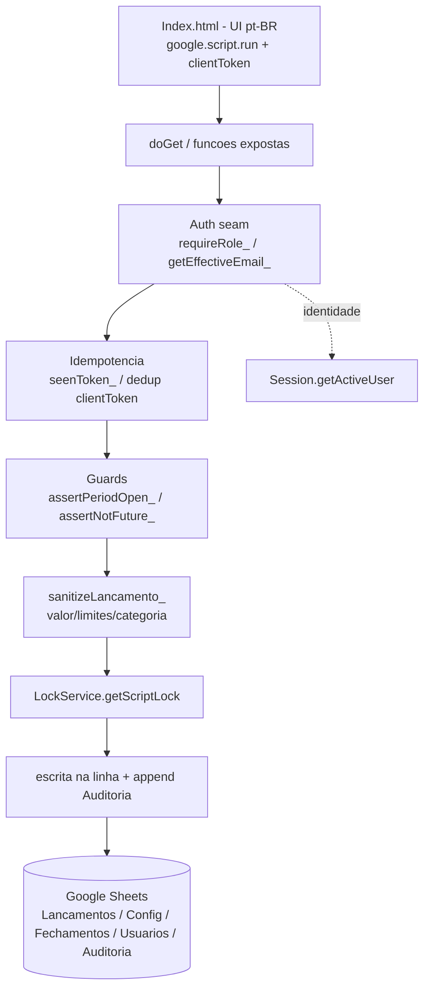

# Lançamentos & Saldo — Design (v2)

**Spec**: [.specs/features/lancamentos-saldo/spec.md](spec.md) (oficial, v2)
**Context**: [.specs/features/lancamentos-saldo/context.md](context.md)
**Status**: Draft
**Substitui**: o design anterior (v1), removido. Esta versão alinha-se à spec v2 oficializada (AD-010): soft-delete (LANC-11), trilha de auditoria append-only (LANC-12) e idempotência por `clientToken` (LANC-10), além dos endurecimentos de precisão.

---

## Architecture Overview

Primeira ferramenta de produção (não-spike). Stack A validada no M0 (AD-007): **web app Apps Script** (HtmlService) com dados em **Google Sheets**, identidade via **Google Workspace SSO** (AD-004) e autorização **server-side**. Vive em `cash-flow/` (hoje vazio).

Toda escrita passa por barreiras no servidor, **nesta ordem**: **autorização** (papel) → **idempotência** (dedup por `clientToken`) → **guarda de período/data** (mês aberto, data não-futura) → **sanitização/limites** (fronteira) → **lock** → **escrita + auditoria**. O saldo é **recalculado sob demanda** sobre os lançamentos **não excluídos** (volume pequeno; evita saldo materializado fora de sincronia). Concorrência protegida por **LockService**. Correções nunca apagam dados: **edição** atualiza a linha e registra trilha; **exclusão** é **lógica** (soft-delete).

---

## Approaches Considered (decisão de auditoria/correção)

A stack está fixada por AD-007 (Apps Script + Sheets); a decisão arquitetural real desta feature é **como corrigir lançamentos preservando a prestação de contas**. Três abordagens foram avaliadas:

| Abordagem | Como funciona | Trade-off | Veredito |
| --------- | ------------- | --------- | -------- |
| **A. Soft-delete + edição in-place + aba `Auditoria` append-only** ⭐ | Linha viva editável; exclusão marca `excluido`; toda edição/exclusão anexa registro append-only | UX simples (1 linha por lançamento) **e** histórico preservado fora da linha | **Escolhida** — honra a lição append-only do STATE com custo baixo |
| B. Ledger 100% append-only (estorno) | Toda correção é um novo lançamento de ajuste; nada muda no lugar | Auditoria máxima, mas a lista enche de estornos e confunde o tesoureiro não-técnico (contra AD-001) | Rejeitada — fricção alta para o usuário |
| C. v1: exclusão física + só "última alteração" na linha | Apaga a linha; guarda só quem/quando da última mudança | Mais simples ainda, mas perde histórico e apaga dados (diverge da lição) | Rejeitada (era a v1; superada por AD-010) |

A escolhida (A) é a base do restante deste design.

---

## Code Reuse Analysis

A maior parte da fundação já foi provada nos spikes do M0. Esta feature **promove** esses padrões a código de produção em `cash-flow/`.

### Existing Components to Leverage

| Component | Location | How to Use |
| --------- | -------- | ---------- |
| Auth seam (`getRealEmail_`, `getEffectiveEmail_`, `roleOf_`, `requireRole_`, `ensureBootstrapAdmin_`, `countAdmins_`) | [spikes/m0-roles/Code.gs](../../../spikes/m0-roles/Code.gs) | Copiar como base do módulo de autorização; é o seam que a feature "Papéis" depois assume por inteiro. Inclui o **bootstrap anti-lockout** (mitiga o gotcha do e-mail vazio na 1ª execução). |
| Data layer pattern (`getSpreadsheet_` via `PropertiesService` + `PROP_SHEET_ID`, `buildSheets_`, append/read por aba) | [spikes/m0-roles/Code.gs](../../../spikes/m0-roles/Code.gs) | Mesmo padrão de bootstrap da planilha e leitura linha-a-linha; estender `buildSheets_` para criar a aba `Auditoria`. |
| Sanitização de fronteira (`sanitizeLancamento_`) | [spikes/m0-roles/Code.gs](../../../spikes/m0-roles/Code.gs) | Estender: tipo/valor/categoria/descrição + validar data, normalizar moeda, aplicar limites de campo e teto de valor. |
| Helpers pt-BR (`formatBRL_`, `formatDate_`, `MONTH_NAMES`, `TZ`) | [spikes/m0-reports/Code.gs](../../../spikes/m0-reports/Code.gs) | Reusar formatação R$/dd-mm-aaaa e timezone `America/Sao_Paulo` (base do "hoje"/data futura). |
| Agregação de saldo (somar entradas − saídas) | [spikes/m0-reports/Code.gs](../../../spikes/m0-reports/Code.gs) | Base do cálculo de saldo corrente (sem materializar), **filtrando lançamentos `excluido`**. |
| `appsscript.json` (scopes, `executeAs USER_DEPLOYING`, `access DOMAIN`) | [spikes/m0-roles/appsscript.json](../../../spikes/m0-roles/appsscript.json) | Copiar tal qual (sheets + drive + userinfo.email). `access` fica `DOMAIN` (leitura pública é da feature Relatórios). |

### Integration Points

| System | Integration Method |
| ------ | ------------------ |
| Google Workspace SSO | `Session.getActiveUser().getEmail()` como âncora de identidade (confiável no domínio). |
| Feature "Papéis" (futura) | Esta feature cria a aba `Usuarios` + `requireRole_` mínimos; a feature Papéis assume a gestão completa. Contrato: `requireRole_(['admin','tesoureiro'])` para escrita; leitura inclui `leitor`. |
| Feature "Relatórios" (futura) | Lê `Lancamentos` (ignorando `excluido`) + `Config` (abertura) + `Fechamentos`. Esta feature define o schema; Relatórios só consome. A aba `Auditoria` é interna (não exposta a Relatórios). |

---

## Components

Tudo em `cash-flow/Code.gs` (organizado por seções) + `cash-flow/Index.html` + `cash-flow/appsscript.json`. Um único `.gs` segue a convenção dos spikes; se crescer, dividir por seção.

### Web entry
- **Purpose**: Servir a UI e expor as funções chamáveis via `google.script.run`.
- **Location**: `cash-flow/Code.gs`
- **Interfaces**: `doGet()` → `HtmlService` Index.
- **Reuses**: padrão `doGet` dos spikes.

### Auth seam
- **Purpose**: Resolver identidade e barrar ações por papel no servidor.
- **Interfaces**: `getRealEmail_()`, `getEffectiveEmail_()`, `roleOf_(email)`, `requireRole_(allowed)`, `ensureBootstrapAdmin_()`.
- **Dependencies**: aba `Usuarios`, `Session`, `PropertiesService`.
- **Reuses**: m0-roles (cópia direta, sem a parte de simulação "ver como"). Bootstrap anti-lockout cobre o gotcha do e-mail vazio.

### Idempotency guard *(novo — LANC-10)*
- **Purpose**: Impedir lançamentos duplicados por duplo-clique/reenvio.
- **Interfaces**: `seenToken_(clientToken)` → `{ seen, id? }`, `rememberToken_(clientToken, id)`.
- **Implementação**: tokens recentes guardados em `CacheService` (TTL curto, ex.: 6 h) **e** validados contra a coluna `ClientToken` da aba `Lancamentos` dentro do lock (fonte de verdade). Se o token já existe → retorna o `id` existente como sucesso idempotente, sem nova linha.
- **Dependencies**: `CacheService`, aba `Lancamentos`, LockService.

### Lançamentos service
- **Purpose**: CRUD dos lançamentos com guardas e trilha.
- **Interfaces** (expostas):
  - `listLancamentos(filtro)` → `Lancamento[]` — papel: admin/tesoureiro/leitor. Retorna só não `excluido`; filtro por mês/tipo/categoria (LANC-09); ordenação por `Data` desc, empate por `CriadoEm` desc.
  - `addLancamento(item, clientToken)` → `{ ok, id }` — admin/tesoureiro. Passa por idempotência → guards → sanitização → lock → append linha + append `Auditoria`(criar).
  - `editLancamento(id, item)` → `{ ok }` — admin/tesoureiro. Período aberto; grava `AlteradoPor/AlteradoEm` + append `Auditoria`(editar, antes→depois).
  - `deleteLancamento(id)` → `{ ok }` — admin/tesoureiro. **Soft-delete** (marca `excluido`, grava `ExcluidoPor/ExcluidoEm`) + append `Auditoria`(excluir).
- **Dependencies**: auth seam, idempotency guard, guards de período/data, sanitização, LockService, abas `Lancamentos` + `Fechamentos` + `Auditoria`.

### Saldo service
- **Purpose**: Saldo de abertura + saldo corrente.
- **Interfaces**:
  - `getCashState()` → `{ aberturaDefinida, saldoAbertura, totalEntradas, totalSaidas, saldoAtual }` — admin/tesoureiro/leitor. Soma só lançamentos não `excluido`; se abertura indefinida, trata como 0 e marca `aberturaDefinida=false`.
  - `setOpeningBalance({ valor, data })` → `{ ok }` — admin/tesoureiro; aceita `valor >= 0` e data não-futura; falha se já definido.
- **Dependencies**: aba `Config` (abertura) + `Lancamentos`.
- **Reuses**: agregação do m0-reports.

### Fechamento service
- **Purpose**: Fechar/reabrir mês e expor estado dos períodos, com transições explícitas.
- **Interfaces**:
  - `listClosedPeriods()` → `Periodo[]`.
  - `closeMonth(periodo)` → `{ ok, jaFechado? }` — admin/tesoureiro. Só fecha mês `<=` corrente; mês futuro → erro; já fechado → no-op idempotente.
  - `reopenMonth(periodo)` → `{ ok, jaAberto? }` — admin/tesoureiro. Já aberto → no-op idempotente; preserva o registro de fechamento anterior.
  - `isPeriodClosed_(yyyymm)` → `boolean` (interno).
- **Dependencies**: aba `Fechamentos`, LockService, helper de "mês corrente" (TZ).

### Categorias
- **Purpose**: Autocomplete de categorias já usadas, com normalização.
- **Interfaces**: `listCategorias()` → `string[]` (distintas por chave normalizada — sem caixa/acento/espaço nas pontas —, exibindo a 1ª grafia usada, ordenadas) — admin/tesoureiro.
- **Dependencies**: aba `Lancamentos` (ignora `excluido`).

### Validation / helpers
- **Interfaces**: `sanitizeLancamento_(item)`, `assertNotFuture_(date)`, `assertPeriodOpen_(date)`, `periodKey_(date)` (→ `'YYYY-MM'`), `parseDateBR_`, `formatDate_`, `formatBRL_`, `normalizeCategoryKey_(s)`, `assertLimits_(item)` (teto de valor / tamanhos de texto).

### Auditoria *(novo — LANC-12)*
- **Purpose**: Trilha append-only de toda escrita que altera um lançamento.
- **Interfaces**: `appendAudit_(acao, id, detalhe)` (interno, sempre dentro do lock da operação).
- **Dependencies**: aba `Auditoria`.

---

## Data Models

Uma planilha (`Fluxo de Caixa — APP (dados)`), ID guardado em `PropertiesService` (`CASHFLOW_SHEET_ID`). **Cinco** abas.

### Aba `Lancamentos`

| Coluna | Tipo | Notas |
| ------ | ---- | ----- |
| Id | string (UUID) | chave |
| Data | date | data do lançamento (não-futura; mês aberto) |
| Tipo | `entrada` \| `saida` | |
| Categoria | string | texto livre (trim), ≤ 60 chars |
| Valor | number | > 0, 2 casas, ≤ 1.000.000,00 |
| Descricao | string | ≤ 280 chars |
| CriadoPor | string (email) | servidor |
| CriadoEm | datetime | servidor, `dd/MM/yyyy HH:mm` (desempate de ordenação) |
| AlteradoPor | string (email) | última alteração; vazio se nunca editado |
| AlteradoEm | datetime | última alteração |
| Excluido | boolean | `true` = soft-deleted (omitido de lista/saldo) *(novo)* |
| ExcluidoPor | string (email) | quem excluiu (logicamente) *(novo)* |
| ExcluidoEm | datetime | quando excluiu *(novo)* |
| ClientToken | string (UUID) | token de idempotência da criação *(novo, LANC-10)* |

> Edição = atualizar a linha no lugar + `AlteradoPor/AlteradoEm` + append `Auditoria`. Exclusão = **lógica** (`Excluido=true` + `Excluido*`) + append `Auditoria`. Ambas só com o mês aberto.

### Aba `Config` (key-value, singletons)

| Chave | Valor | AtualizadoPor | AtualizadoEm |
| ----- | ----- | ------------- | ------------ |
| `SALDO_ABERTURA_VALOR` | number (≥ 0) | email | datetime |
| `SALDO_ABERTURA_DATA` | date (não-futura) | email | datetime |

> "Abertura definida" = existência da chave `SALDO_ABERTURA_VALOR`. Segundo `setOpeningBalance` é rejeitado (corrige-se editando o registro existente, se aberto).

### Aba `Fechamentos`

| Periodo | Status | FechadoPor | FechadoEm | ReabertoPor | ReabertoEm |
| ------- | ------ | ---------- | --------- | ----------- | ---------- |
| `YYYY-MM` | `fechado` \| `aberto` | email | datetime | email | datetime |

> Mês **sem linha** = aberto (nunca fechado). `closeMonth` cria/atualiza para `fechado` (só `<=` corrente). `reopenMonth` muda para `aberto` mantendo o último fechar/reabrir. Transições inválidas (fechar fechado / reabrir aberto) = no-op idempotente.

### Aba `Usuarios` (seam de autorização — mínimo)

| Email | Nome | Papel |
| ----- | ---- | ----- |
| email | string | `admin` \| `tesoureiro` \| `leitor` |

> Bootstrap anti-lockout (m0-roles): primeiro usuário conhecido vira `admin`. A feature "Papéis" assume a gestão completa depois.

### Aba `Auditoria` *(nova — append-only, LANC-12)*

| Carimbo | Acao | LancamentoId | Autor | Detalhe |
| ------- | ---- | ------------ | ----- | ------- |
| datetime (servidor) | `criar` \| `editar` \| `excluir` | UUID | email | resumo antes→depois (JSON curto) |

> Nunca editada nem apagada por código de produto. Cresce linearmente; volume pequeno. Não exposta a Relatórios.

---

## Error Handling Strategy

| Error Scenario | Handling | User Impact |
| -------------- | -------- | ----------- |
| Valor ≤ 0, vazio, não numérico ou > 2 casas | `throw` em pt-BR na sanitização | "Informe um valor maior que zero, com até dois centavos." |
| Valor acima do teto técnico (R$ 1.000.000,00) | UI exige confirmação explícita; servidor aceita se confirmado | Diálogo "Valor alto — confirmar?" |
| Descrição/categoria acima do limite | `assertLimits_` lança | "Descrição/categoria muito longa." |
| Data futura | `assertNotFuture_` lança | "Não é possível lançar com data futura." |
| Data/edição/exclusão em mês fechado | `assertPeriodOpen_` lança (revalidado no servidor) | "O período MM/AAAA está fechado. Reabra-o para alterar." |
| Abertura negativa / já definida | `throw` | "Saldo de abertura não pode ser negativo." / "O saldo de abertura já foi registrado." |
| Reenvio do mesmo `clientToken` | Idempotency guard retorna o `id` existente | Sucesso silencioso, **sem duplicar** |
| Fechar mês futuro | `throw` | "Não é possível fechar um mês futuro." |
| Fechar mês já fechado / reabrir mês já aberto | no-op idempotente | Aviso "já estava fechado/aberto" (não é erro) |
| Lançamento não encontrado (edit/delete) | `throw` | "Lançamento não encontrado." |
| Papel insuficiente | `requireRole_` lança | "Acesso negado: ação exige papel [...]" |
| Gravações concorrentes | `LockService.getScriptLock().tryLock(ms)`; timeout → `throw` | "Sistema ocupado, tente novamente." |
| `getActiveUser().getEmail()` vazio (1ª execução) | Bootstrap anti-lockout; não grava autor `desconhecido` | Recarregar resolve; sem dado órfão |
| Saldo corrente negativo | **Permitido**; sinalizado na UI | Saldo em vermelho + alerta (não bloqueia) |

Regra geral: a UI esconder botões é só cosmético — **toda** validação é revalidada no servidor.

---

## Risks & Concerns

Concerns levantados ao percorrer os spikes reusados (Knowledge Verification Chain — Step 1/2).

| Concern | Location | Impact | Mitigation |
| ------- | -------- | ------ | ---------- |
| `getActiveUser().getEmail()` pode vir vazio na 1ª execução (gotcha do STATE) | seam copiado de [spikes/m0-roles/Code.gs](../../../spikes/m0-roles/Code.gs) | Autor órfão / base sem admin | Reusar bootstrap anti-lockout do m0-roles; nunca depender do e-mail no exato instante de criação da base. |
| Dedup só em `CacheService` perderia tokens se o cache expirar/evict | Idempotency guard | Janela rara para duplicata | `ClientToken` persistido na aba `Lancamentos` é a fonte de verdade, checada **dentro do lock**; cache é só atalho. |
| Custo de varrer `Lancamentos` para saldo/categorias/dedup a cada chamada | Saldo/Categorias/Idempotência | Latência cresce com o nº de linhas | Volume pequeno (centenas/ano); aceitável. Se crescer, indexar/cachear agregados — fora do escopo agora. |
| Trilha `Auditoria` cresce indefinidamente | Aba `Auditoria` | Planilha grande no longo prazo | Volume baixo; arquivamento/rotação é trilha de integridade de dados do M0, não desta feature. |
| Escrita não-transacional no Sheets (linha + append `Auditoria` em chamadas separadas) | Lançamentos service | Falha entre as duas escritas deixa linha sem auditoria | Ambas dentro do mesmo lock e na mesma ordem; se o append de auditoria falhar, a operação lança e a linha de dados é a única fonte — auditoria é complementar, não bloqueante. Aceito para a stack Sheets. |

---

## Tech Decisions (não óbvias)

| Decision | Choice | Rationale |
| -------- | ------ | --------- |
| Correção de lançamento | **Soft-delete + edição in-place + aba `Auditoria`** | AD-010: honra a lição "auditoria append-only" do STATE sem encher a lista de estornos (mantém UX simples p/ tesoureiro). Supera a D-4 da v1. |
| Idempotência | `clientToken` (UUID por formulário) + dedup no cache e na coluna `ClientToken` dentro do lock | Elimina duplicatas silenciosas do `google.script.run` (LANC-10); fonte de verdade persistida evita perda por expiração de cache. |
| Cálculo de saldo | **Recalcular sob demanda** (não materializar), ignorando `excluido` | Volume pequeno; elimina risco de saldo materializado fora de sincronia após edição/exclusão lógica. |
| Concorrência | `LockService.getScriptLock()` em toda escrita | Integridade em Sheets; serializa append/edição/soft-delete/fechamento e a checagem de token. |
| Estado de período | Aba `Fechamentos`, ausência de linha = aberto; transições explícitas e idempotentes | Simples, audita fechar/reabrir, sem varrer lançamentos; cobre LANC-07/08 com precisão. |
| Abertura | Aba `Config` key-value, `valor >= 0` | Extensível p/ outros singletons; zero permitido (adoção do zero), negativo bloqueado. |
| Categoria | Texto livre + normalização por chave (sem caixa/acento/espaço) para sugerir | Incentiva consistência sem impor lista fixa (D-3). |
| Autorização | Reusar `requireRole_` do m0-roles, **sem** "ver como" | Papéis é feature à parte; aqui só o seam mínimo. |
| Organização de arquivos | Tool em `cash-flow/` (1 `.gs` + `Index.html` + `appsscript.json`) | Segue a convenção dos spikes. |

> **Project-level:** AD-010 (no STATE) já registra a decisão de auditoria/soft-delete/idempotência como padrão desta feature. As demais escolhas são feature-local.

---

## Requirement → Component Map

| Req | Componente / Interface |
| --- | ---------------------- |
| LANC-01 (abertura) | Saldo service: `setOpeningBalance` (≥ 0, não-futura), `getCashState` (Config) |
| LANC-02 (registrar) | Lançamentos: `addLancamento` + guards + sanitização + LockService |
| LANC-03 (saldo corrente) | Saldo service: `getCashState` (recálculo, ignora `excluido`, abertura indefinida = 0) |
| LANC-04 (listar) | Lançamentos: `listLancamentos` (oculta `excluido`, desempate por `CriadoEm`) |
| LANC-05 (editar/excluir + trilha) | Lançamentos: `editLancamento`/`deleteLancamento` + colunas `Alterado*`/`Excluido*` + `appendAudit_` |
| LANC-06 (autocomplete categoria) | Categorias: `listCategorias` + `normalizeCategoryKey_` |
| LANC-07 (fechar mês) | Fechamento: `closeMonth` + `assertPeriodOpen_` (transições/idempotência) |
| LANC-08 (reabrir) | Fechamento: `reopenMonth` (idempotente, preserva fechamento) |
| LANC-09 (filtrar) | Lançamentos: `listLancamentos(filtro)` (mês/tipo/categoria) |
| LANC-10 (idempotência) | Idempotency guard: `seenToken_`/`rememberToken_` + coluna `ClientToken` |
| LANC-11 (soft-delete) | Lançamentos: `deleteLancamento` (lógico) + colunas `Excluido*` |
| LANC-12 (auditoria) | Auditoria: `appendAudit_` + aba `Auditoria` |

---

## Open Questions / Notes

- **Deploy "Qualquer pessoa" (leitura pública / B-006)** é da feature *Relatórios*, não desta — aqui `access` fica `DOMAIN`.
- **Testes**: seguir o harness Node dos spikes (ex.: `m0-roles`) para testar a lógica pura fora do Apps Script — cálculo de saldo (com `excluido`), guardas de período/data, sanitização/limites, dedup por token, normalização de categoria e transições de fechamento. Detalhar na fase Tasks.
