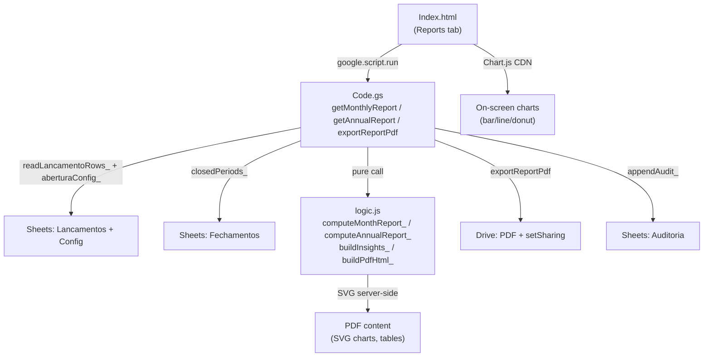

# Relatórios (Fluxo de Caixa) Design

**Spec**: `.specs/features/relatorios/spec.md`
**Status**: Draft

---

## Architecture Overview

The feature follows the project's established split: **pure aggregation logic** in
`cash-flow/logic.js` (testable with Vitest, dual-env) and **glue** (Drive/Sheets/HtmlService)
in `cash-flow/Code.gs`. The UI extends the existing `cash-flow/Index.html` with a
reports tab/section.



**Key architectural decision**: Push all decidable computation (aggregation, insights,
SVG generation, PDF HTML assembly) into `logic.js` as **pure functions** — deterministic,
no I/O, no `new Date()` without argument, no `Utilities`. This maximizes testable
surface with Vitest while keeping `Code.gs` a thin glue layer. The spike's helpers
(`buildInsights_`, `buildSvgBars_`, `buildPdfHtml_`, `toSortedPairs_`, `pct_`,
`escapeHtml_`) are ported to `logic.js`; `formatBRL_` and `formatDate_` already exist
there.

---

## Code Reuse Analysis

### Existing Components to Leverage

| Component | Location | How to Use |
| --------- | -------- | ---------- |
| `computeMonthState_(config, rows, mes)` | `cash-flow/logic.js` | Reuse directly for monthly report KPIs (saldoInicio, entradas, saídas, saldoFinal) |
| `computeCashState_(config, rows)` | `cash-flow/logic.js` | Reuse for annual report global KPIs |
| `listForView_(rows, filtro)` | `cash-flow/logic.js` | Reuse for monthly entry list (filter by month, exclude soft-deleted, sorted) |
| `computeCategorias_(rows)` | `cash-flow/logic.js` | Reuse for category list reference |
| `normalizeCategoryKey_(s)` | `cash-flow/logic.js` | Reuse for category-level aggregation grouping key |
| `formatBRL_(value)` | `cash-flow/logic.js` | Reuse for all pt-BR currency formatting (screen + PDF) |
| `formatDate_(date)` | `cash-flow/logic.js` | Reuse for `dd/MM/yyyy` dates |
| `periodKey_(date)` | `cash-flow/logic.js` | Reuse for month-key extraction |
| `pad2_(n)` | `cash-flow/logic.js` | Reuse for zero-padding |
| `round2_(n)` | `cash-flow/logic.js` | Reuse for rounding |
| `readLancamentoRows_()` | `cash-flow/Code.gs` | Read all entries once per report call |
| `aberturaConfig_()` | `cash-flow/Code.gs` | Opening balance for carry-forward |
| `closedPeriods_()` / `listClosedPeriodsData_()` | `cash-flow/Code.gs` | Determine provisional/official badge per month |
| `requireRole_(roles)` | `cash-flow/Code.gs` | Guard: only `admin`/`tesoureiro` |
| `withLock_(fn)` | `cash-flow/Code.gs` | Serialize PDF generation (avoid duplicate files) |
| `appendAudit_(acao, id, detalhe)` | `cash-flow/Code.gs` | Audit trail for PDF publication |
| `getComprovanteFolder_()` pattern | `cash-flow/Code.gs` | Pattern for `getReportFolder_()` (PropertiesService pin + recreate-on-miss) |
| Spike: `getMonthlyReport`, `getAnnualReport`, `buildInsights_`, `buildPdfHtml_`, `buildSvgBars_`, `exportAnnualPdf` | `spikes/m0-reports/Code.gs` | **Port logic** to `logic.js`; port glue to `Code.gs` — adapt to production data model |

### Integration Points

| System | Integration Method |
| ------ | ------------------ |
| Sheets (Lancamentos/Config/Fechamentos) | Existing `readLancamentoRows_()` + `aberturaConfig_()` + `closedPeriods_()` — no schema changes |
| Drive (PDF storage) | New `getReportFolder_()` (pattern from `getComprovanteFolder_`) + `createFile` + `setSharing(ANYONE_WITH_LINK, VIEW)` |
| Sheets (Auditoria) | Existing `appendAudit_()` — action `gerar_relatorio` |
| UI (Index.html) | New reports section: month/year selectors, KPI cards, Chart.js charts, entry table, "Gerar PDF" button |

---

## Components

### Pure Logic — Report Aggregation (`logic.js`)

- **Purpose**: Compute monthly/annual report data, insights, SVG charts, and PDF HTML — all as pure functions.
- **Location**: `cash-flow/logic.js` (appended after existing functions)
- **Interfaces**:
  - `computeMonthReport_(config, allRows, mes, closedPeriods)` → `{ mes, ano, mesFmt, entradasMes, saidasMes, saldoMes, saldoAcumulado, provisorio, lancamentos: [{...}] }`
    - Calls `computeMonthState_` for KPIs; filters `allRows` for non-deleted entries of month `mes`; checks `closedPeriods` for `provisorio` flag.
  - `computeAnnualReport_(config, allRows, ano, closedPeriods)` → `{ ano, totalEntradas, totalSaidas, resultado, saldoAcumulado, meses: [{mesKey, entradas, saidas, saldo, acumulado, provisorio}], porCategoria: [{categoria, total}], insights: [string] }`
    - Iterates 12 months, builds series, computes category breakdown using `normalizeCategoryKey_`, calls `buildInsights_`.
  - `buildInsights_(ano, meses, porCategoriaEntrada, porCategoriaSaida, totalEntradas, totalSaidas)` → `[string]` (pt-BR insight phrases)
    - Ported from spike with production naming/structure.
  - `buildMonthlyPdfHtml_(monthReport, generatedStamp)` → `string` (HTML for PDF conversion)
    - Month KPIs + entry table with comprovante links + privacy note + SVG chart.
  - `buildAnnualPdfHtml_(annualReport, generatedStamp)` → `string` (HTML for PDF conversion)
    - Annual KPIs + monthly movement table + category tables + SVG bar chart + insights.
  - `buildSvgBars_(meses)` → `string` (SVG markup of monthly balance bars)
    - Ported from spike.
  - `toSortedPairs_(obj)` → `[{key, value}]` — sort descending by value.
  - `pct_(part, whole)` → `string` — percentage label.
  - `escapeHtml_(s)` → `string` — sanitize for HTML embedding.
  - `reportPdfFileName_(tipo, periodo)` → `string` — e.g. `Relatorio_APP_mensal_2025-07.pdf` or `Relatorio_APP_anual_2025.pdf`.
- **Dependencies**: Existing `computeMonthState_`, `computeCashState_`, `listForView_`, `normalizeCategoryKey_`, `formatBRL_`, `formatDate_`, `periodKey_`, `round2_`, `pad2_`.
- **Reuses**: Spike's `buildInsights_`, `buildSvgBars_`, `buildPdfHtml_` (adapted to production model fields).

### Glue — Report Endpoints (`Code.gs`)

- **Purpose**: Serve report data to the UI and generate/publish PDFs on Drive.
- **Location**: `cash-flow/Code.gs` (new section after existing services)
- **Interfaces**:
  - `getMonthlyReport(mes)` → JSON (monthly report)
    - `requireRole_(['admin','tesoureiro'])` → reads rows once → `computeMonthReport_`.
  - `getAnnualReport(ano)` → JSON (annual report)
    - `requireRole_(['admin','tesoureiro'])` → reads rows once → `computeAnnualReport_`.
  - `exportReportPdf(tipo, periodo)` → `{ ok, url, name }`
    - `requireRole_(['admin','tesoureiro'])` → `withLock_` → compute report → build PDF HTML → `Utilities.newBlob(html).getAs('application/pdf')` → find & trash existing PDF for same period → `createFile` in report folder → `setSharing(ANYONE_WITH_LINK, VIEW)` → `appendAudit_('gerar_relatorio', ...)` → return `{ ok, url, name }`.
    - On failure inside the lock: no file created (blob→file is atomic; if `setSharing` fails, trash the file before rethrowing → no orphan).
  - `getReportFolder_()` → `Folder`
    - Pattern: `PropertiesService` pin (`REPORT_FOLDER_ID`) + recreate-on-miss (same as `getComprovanteFolder_`).
  - `findExistingReportPdf_(folder, tipo, periodo)` → `File | null`
    - Searches the report folder for a file matching `reportPdfFileName_(tipo, periodo)` to trash before replacing.
- **Dependencies**: `readLancamentoRows_`, `aberturaConfig_`, `closedPeriods_`, `requireRole_`, `withLock_`, `appendAudit_`, `DriveApp`, `Utilities`.
- **Reuses**: `getComprovanteFolder_` pattern, spike's `exportAnnualPdf` flow.

### UI — Reports Section (`Index.html`)

- **Purpose**: Display reports on-screen and offer PDF export.
- **Location**: `cash-flow/Index.html` (new tab/section in existing SPA)
- **Interfaces**:
  - Month/Year selectors (dropdowns) → calls `google.script.run.getMonthlyReport(mes)` / `getAnnualReport(ano)`.
  - KPI cards (totais, saldo, provisório/oficial badge).
  - Monthly: entry table with "ver comprovante" links (public URLs from `ComprovanteUrl`), "—" when absent.
  - Annual: Chart.js charts (bar entradas×saídas, line acumulado, donut despesas por categoria) with graceful degradation (if CDN blocked, show warning, tables remain).
  - Annual: insights list.
  - "Gerar PDF" button → `google.script.run.exportReportPdf(tipo, periodo)` → shows link; disable button during call.
  - Provisório badge (yellow) / Oficial badge (green) per the month's closed status.
  - Privacy note (discreto) near comprovante links: "Os links de comprovante são públicos."
  - Empty-state: "Sem lançamentos neste período." + zeroed KPIs.
- **Dependencies**: Chart.js CDN (jsdelivr), `google.script.run`, existing CSS/layout.
- **Reuses**: Existing UI patterns (loading spinner, error toasts, `google.script.run` wrappers).

---

## Data Models

No schema changes to the spreadsheet. Reports are **read-only aggregations** of existing data.

### Monthly Report Object (pure → JSON)

```javascript
{
  mes: '2025-07',        // period key
  ano: 2025,
  mesFmt: '07/2025',     // display label
  entradasMes: 1520.00,  // R$ total entries this month
  saidasMes: 650.00,
  saldoMes: 870.00,      // entradas - saídas
  saldoAcumulado: 4230.00, // opening + all months through this one
  provisorio: false,     // true if month is NOT in closedPeriods
  lancamentos: [         // non-deleted entries of this month, sorted date desc
    { Id: 'L5', Data: '2025-07-15', Tipo: 'saida', Categoria: 'Material',
      Valor: 280, Descricao: 'Compra de papel', ComprovanteUrl: 'https://...', TemComprovante: true },
    // ...
  ]
}
```

### Annual Report Object (pure → JSON)

```javascript
{
  ano: 2025,
  totalEntradas: 18200.00,
  totalSaidas: 14850.00,
  resultado: 3350.00,       // superávit / déficit
  saldoAcumulado: 4350.00,  // opening + year result
  meses: [
    { mesKey: '2025-01', mesFmt: '01/2025', entradas: 1520, saidas: 650,
      saldo: 870, acumulado: 1870, provisorio: false },
    // ... 12 entries
  ],
  porCategoriaEntrada: [ { categoria: 'Contribuição', total: 14400 }, ... ],
  porCategoriaSaida:   [ { categoria: 'Material', total: 4560 }, ... ],
  insights: [
    'Melhor mês: jun (saldo R$ 1.840,50).',
    // ...
  ]
}
```

### PDF lifecycle

- File name: `Relatorio_APP_mensal_2025-07.pdf` or `Relatorio_APP_anual_2025.pdf`.
- Stored in a dedicated Drive folder: `Fluxo de Caixa — Relatórios` (pinned via `REPORT_FOLDER_ID` in `PropertiesService`).
- On regeneration: `findExistingReportPdf_` locates the file by name → `file.setTrashed(true)` → new file created → link changes.

---

## Error Handling Strategy

| Error Scenario | Handling | User Impact |
| -------------- | -------- | ----------- |
| User without `admin`/`tesoureiro` role | `requireRole_` throws | "Acesso negado" toast |
| Invalid month/year parameter | Normalize/reject server-side; render empty report | Empty report or pt-BR error message |
| Chart.js CDN blocked by CSP | `window.onerror` or load check → show warning banner | Tables and KPIs remain visible; charts section shows "Gráficos indisponíveis" |
| PDF generation fails mid-way (blob conversion) | Error thrown inside `withLock_`; no file created yet → no orphan | Error toast: "Erro ao gerar o PDF. Tente novamente." |
| `setSharing` fails after file creation | Catch → `file.setTrashed(true)` → rethrow → no public orphan (REL-15) | Error toast |
| Report folder deleted externally | `getReportFolder_` recreates on miss (pattern from comprovantes) | Transparent to user |
| Two simultaneous PDF generations for same period | `withLock_` serializes → second caller waits → no duplicate files | Slightly longer wait for second caller |

---

## Risks & Concerns

| Concern | Location | Impact | Mitigation |
| ------- | -------- | ------ | ---------- |
| `readLancamentoRows_()` reads ALL entries every call | `Code.gs:344` | Performance degrades with thousands of entries (unlikely for a school APP but possible over years) | Acceptable for MVP; the spike worked fine with ~70 rows. If needed later, add caching or a year filter to the Sheets read. |
| `Utilities.newBlob(html).getAs('application/pdf')` rendering quality | Apps Script runtime | Google's HTML→PDF converter is basic; complex CSS may render differently | Use simple, inline CSS (validated in spike). SVG charts render correctly (spike-proven). |
| Chart.js CDN availability | `Index.html` | If jsdelivr is down or blocked, no charts on screen | Graceful degradation: detect load failure, show warning, tables remain. PDF uses server-side SVG (unaffected). |
| `setSharing` permission on the Drive folder may be restricted by admin | Workspace governance | PDF wouldn't become public | B-004 already proved sharing works. If policy changes, the error is caught and surfaced. |

> All concerns have mitigations. No blocking risks identified.

---

## Tech Decisions (only non-obvious ones)

| Decision | Choice | Rationale |
| -------- | ------ | --------- |
| Where to put aggregation logic | `logic.js` (pure, Vitest-testable) | Follows the established project pattern (lançamentos, comprovantes); maximizes test coverage without mocking Apps Script APIs. |
| PDF file naming = deterministic by type+period | `Relatorio_APP_{tipo}_{periodo}.pdf` | Enables `findExistingReportPdf_` to locate and replace without storing file IDs in properties per period. Simple, self-describing names. |
| Monthly PDF includes comprovante links directly | Public `ComprovanteUrl` in HTML table | AD-011 already exposes comprovantes as public links; consistent. Privacy note added per spec. |
| Insights are pt-BR string phrases (not structured data) | Array of strings | Matches the spike's proven approach; simple to render on screen and in PDF. No need for structured insight objects in MVP. |
| Report endpoints are separate from `getDashboard` | New `getMonthlyReport`/`getAnnualReport` | Reports include extra data (entry list with comprovantes for monthly, category breakdown + insights for annual) that the dashboard doesn't need. Keeping them separate avoids bloating the dashboard payload. |
| `exportReportPdf` handles both monthly and annual via a `tipo` parameter | Single endpoint, two code paths inside | Avoids duplicating the folder/audit/sharing logic. The HTML builder is different per type but the lifecycle is shared. |

---

## Test Strategy

| Code Layer | Test Type | Location | Run Command |
| ---------- | --------- | -------- | ----------- |
| Pure logic (`logic.js`: `computeMonthReport_`, `computeAnnualReport_`, `buildInsights_`, `buildSvgBars_`, `buildMonthlyPdfHtml_`, `buildAnnualPdfHtml_`, `toSortedPairs_`, `pct_`, `escapeHtml_`, `reportPdfFileName_`) | unit (Vitest) | `cash-flow/relatorio.test.js` | `npm test` |
| Glue (`Code.gs`: `getMonthlyReport`, `getAnnualReport`, `exportReportPdf`, `getReportFolder_`, `findExistingReportPdf_`) | none | — | build gate + smoke |
| UI (`Index.html`: reports tab) | none | — | manual deploy |

**Why "none" for glue/UI**: Same rationale as Lançamentos/Comprovantes (AD-001) — `DriveApp`/`SpreadsheetApp`/`Utilities` only exist in Apps Script runtime; all decidable logic is pushed to `logic.js`.
